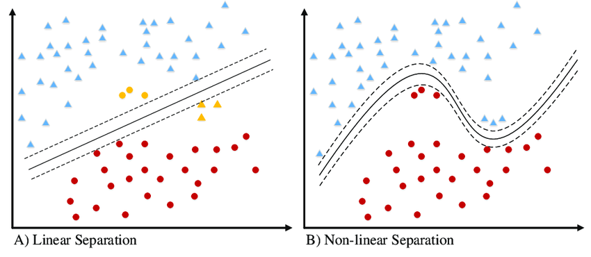
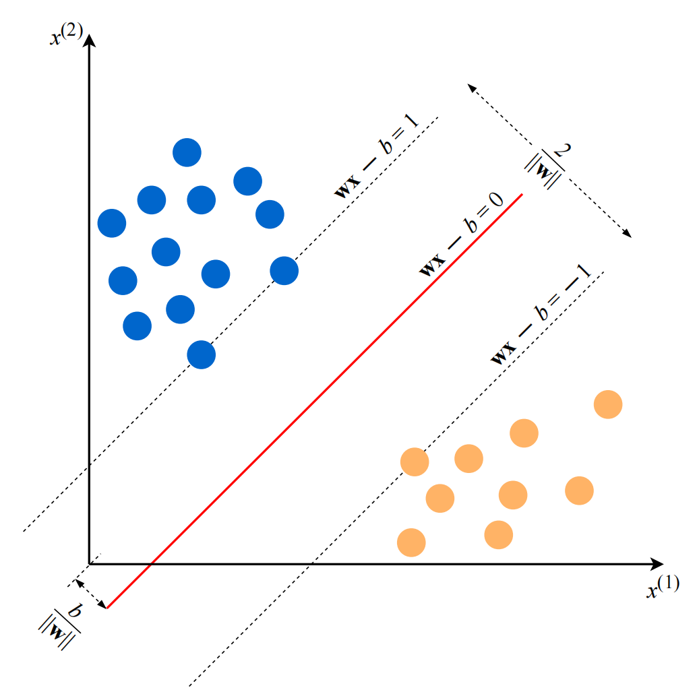

# Introduction
## 1.1 Machine Learning

- **Definition**:
  - Machine learning is a subfield of computer science.
  - It involves building algorithms that rely on examples of a phenomenon.
  - Examples can be sourced from nature, handcrafted, or generated by algorithms.

- **Process**:
  1. Gathering a dataset.
  2. Algorithmically building a statistical model based on the dataset.

- **Utility**:
  - The statistical model is utilized to solve practical problems.

## 1.2 Types of Learning

### 1.2.1 Supervised Learning

- **Definition**:
  - Supervised learning involves labeled examples in the dataset.
  - Each example is represented as (xi, yi), where xi is a feature vector and yi is the label.
  
- **Feature Vector**:
  - Each xi contains features (x(j)) describing the example.
  - Features may include address, salary, rent, etc.
  
- **Labels**:
  - Labels (yi) can be finite set classes or real numbers.
  - Example: {pass, fail} for loan assessment classification.

- **Goal**:
  - Create a model to predict labels based on feature vectors.
  - Example: Predicting loan credit probability based on person's financial health.

### 1.2.2 Unsupervised Learning

- **Definition**:
  - Unsupervised learning involves unlabeled examples.
  - The goal is to transform input vectors to solve practical problems.
  
- **Model Output**:
  - Clustering: Return cluster IDs for each vector.
  - Dimensionality reduction: Output vectors with fewer features.
  - Outlier detection: Output a value indicating deviation from typical examples.

### 1.2.3 Semi-Supervised Learning

- **Definition**:
  - Dataset contains both labeled and unlabeled examples.
  - Unlabeled examples are usually more abundant.

- **Goal**:
  - Similar to supervised learning but leveraging unlabeled data.
  - Aim to produce a better model with the help of unlabeled examples.

### 1.2.4 Reinforcement Learning

- **Definition**:
  - Reinforcement learning operates in an environment.
  - The machine perceives states, takes actions, and receives rewards.

- **Goal**:
  - Learn a policy function that maps states to optimal actions.
  - Optimal actions maximize expected average reward.

## 1.3 How Supervised Learning Works

In this section, we delve into the workings of supervised learning, providing an overview of the process and its application using Support Vector Machine (SVM) as an example.

### Overview

- **Introduction**:
  - Supervised learning is a prevalent type of machine learning used in practice.
  - It involves gathering data in the form of input-output pairs.
  - Inputs can vary, including text, images, or sensor measurements, while outputs are typically real numbers or labels.

### Process

1. **Data Gathering**:
   - Data collection involves obtaining input-output pairs.
   - For example, in spam detection, emails are labeled as "spam" or "not_spam".

2. **Feature Vector Conversion**:
   - Each input (e.g., email) is converted into a feature vector.
   - Common methods include the bag of words approach for text, representing words as binary features.

3. **Label Transformation**:
   - Some algorithms require transforming labels into numerical values.
   - For example, "spam" could be represented as 1 and "not_spam" as 0.

4. **Model Application**:
   - The learning algorithm, such as SVM, is applied to the dataset to build the model.

### Support Vector Machine (SVM)

- **Model Construction**:
  - SVM treats feature vectors as points in a high-dimensional space.
  - It separates examples with positive and negative labels using a hyperplane, termed as the decision boundary.

- **Equation**:
  - 
  - The equation of the hyperplane is defined by parameters w and b.

- **Prediction**:
  - Predicted labels are determined by the sign of the equation wx ≠ b.

- **Optimization**:
  - SVM optimizes w and b to find the optimal decision boundary.

### Model Evaluation and Training

- **Training**:
  - Building the model involves solving an optimization problem to find optimal parameters.

- **Visual Representation**:
  - For two-dimensional feature vectors, the decision boundary can be visualized as a line separating positive and negative examples.

### Further Considerations

- **Model Flexibility**:
  - SVM can create linear or non-linear decision boundaries using kernels.
  - Various factors like noise, labeling errors, or outliers can affect model accuracy.

- **Algorithm Differentiation**:
  - Different learning algorithms have distinct decision boundary forms, impacting model accuracy and computational speed.

- **Practical Considerations**:
  - Besides accuracy, factors such as model building speed and prediction processing time are essential in practical applications.

### Why the Model Works on New Data

- **Decision Boundary**:
  - If two classes are separable by a decision boundary, examples of each class are located in different subspaces created by the boundary.

- **Statistical Likelihood**:
  - If training examples were randomly selected and follow the same procedure, new examples are likely to be close to existing examples of their class on the plot.
  - New negative examples will likely be near other negative examples, and the same applies to new positive examples.
  
- **Probability of Correct Predictions**:
  - The decision boundary will still likely separate new positive and negative examples accurately.
  - Less likely situations may result in errors, but the number of errors is expected to be smaller than correct predictions due to their rarity.

- **Impact of Training Set Size**:
  - A larger set of training examples reduces the probability of new examples being dissimilar to the training set.
  
- **SVM Algorithm**:
  - To minimize errors on new examples, the SVM algorithm seeks the largest margin, aiming to draw the decision boundary as far as possible from examples of both classes.

---

## 2. Notation and Definitions

### 2.1 Notation

#### 2.1.1 Scalars, Vectors, and Sets

- **Scalars**: 
  - Simple numerical values.
  - Denoted by italic letters (e.g., x, a).

- **Vectors**:
  - Ordered list of scalar values (attributes).
  - Denoted as bold characters (e.g., x, w).
  - Visualized as arrows or points in multi-dimensional space.

- **Sets**:
  - Unordered collection of unique elements.
  - Denoted as calligraphic capital characters (e.g., S).
  - Finite or infinite, with specific notation for intervals.
  - Intersection and union operations explained.

#### 2.1.2 Capital Sigma Notation

- **Summation**:
  - Notation for summing over a collection or attributes of a vector.

#### 2.1.3 Capital Pi Notation

- **Product**:
  - Notation for the product of elements in a collection or attributes of a vector.

#### 2.1.4 Operations on Sets

- **Derived Set Creation Operator**:
  - Explanation of creating new sets based on specific criteria.
  
- **Cardinality Operator**:
  - Returns the number of elements in a set.

#### 2.1.5 Operations on Vectors

- **Vector Operations**:
  - Sum, difference, scalar multiplication, and dot-product explained.
  
- **Matrix-Vector Multiplication**:
  - Explanation of multiplication of matrices by vectors.

#### 2.1.6 Functions

- **Definition of Functions**:
  - Relation between elements of sets, with inputs and outputs.
  
- **Local and Global Minimum**:
  - Definition of local and global minima with illustration.

#### 2.1.7 Max and Arg Max

- **Operators**:
  - Explanation of max and arg max operators.

#### 2.1.8 Assignment Operator

- **Assignment**:
  - Explanation of the assignment operator and its usage.

#### 2.1.9 Derivative and Gradient

- **Derivative**:
  - Definition and explanation of derivatives for functions.
  
- **Gradient**:
  - Generalization of derivatives for functions with multiple inputs.
  
- **Chain Rule**:
  - Application of the chain rule in differentiation.

---

This section covers fundamental mathematical notation and definitions essential for understanding machine learning concepts.
